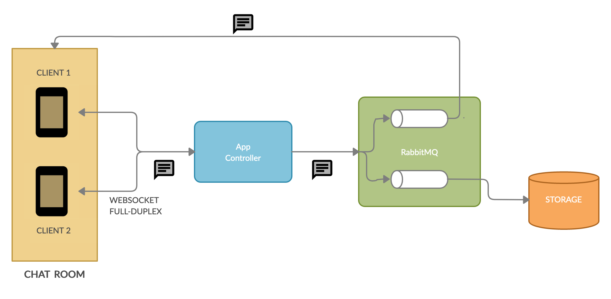

# Uncharted Chat App

A simple chat room implemented in Kotlin and Spring Boot.

## Architecture overview

The application uses Websocket to establish a two-way communication between a client and a server (full-duplex).
WebSocket is a thin, lightweight layer on top of TCP: both the client and the server can trigger communication with one another,
and both can send messages, at the same time.

This chat application uses [RabbitMq](https://www.rabbitmq.com/) to route client-originated chat messages to the Websocket channel and to the storage engine.



The persistence storage is in-memory only.

## How to run

The application can be run locally using Docker.

```
./gradlew bootBuildImage && docker-compose up --build
```

The application is available on port 8081, e.g. http://localhost:8081

## Chat room available commands

`/history <n>` returns the last *n* messages in the channel. The history messages are displayed only to the user who requested them.  

Example:
`/history 20`

## Compile and tests

Runs all the tests: `./gradlew test`

## Additional tasks

Code analysis: `./gradlew codeAnalysis`

Linter: `./gradlew formatCheck`